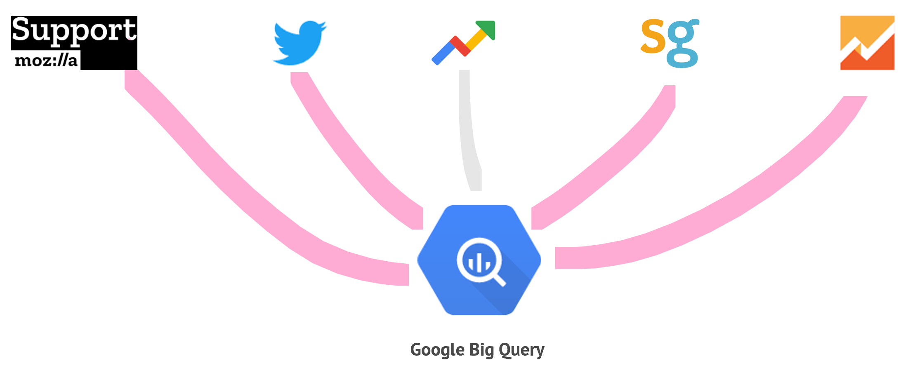
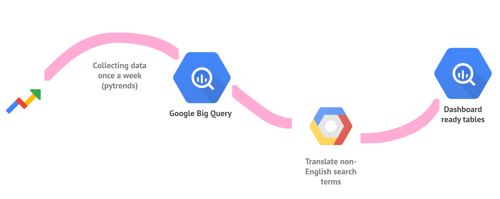
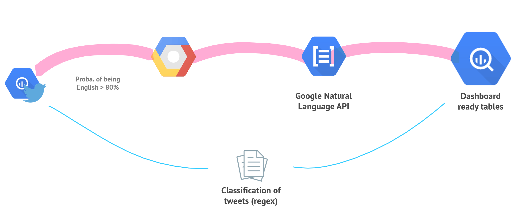

# Firefox Desktop Support Dashboard

This folder contains all the scripts and other files necessary to collect and process the data presented in the Firefox Desktop Support Dashboard. This README provides an in-depth description of the data collected, how this is done and how the data is processed and enhanced before it is stored in the dashboard ready Google Big Query (gbq) tables.  

The dashboard draws on data from a variety of data sources: CSAT (SurveyGizmo), Google Trends, Twitter, Mozilla Support (Kitsune) and Google Analytics. Each of these requires slightly different data processing and this is described in detail below. Common for all data sources is that the end results are saved in a series of gbq tables which the final dashboard draws on.     

**Goals for the dashboard:**
- More effectively deliver Firefox Release and Insights updates for high impact insights to PMs
- Reduce manual processes for delivering insights: less manual reading of Forum posts and social media posts

**By specifically answering the following questions:**
- What is the public sentiment around Firefox from week to week (CSAT, Twitter)
- What are users searching for when they are looking for Firefox (Google Trends)
- Which pain points are users experiencing? (Kitsune and Google Analytics)


## Data sources and pre-processing

In this section we give an overview over the data which is collected and how it is processed. For each data source we also describe what types of insights it provides.  


<small>Figure: Overview of the five data sources collected in this project: Mozilla Support (Kitsune), Twitter, Google Trends, CSAT (Survey Gizmo) and Google Analytics</small>

### Google Trends: Changes in related search terms


<small>Figure: Simplified overview of Google Trends data pipeline.</small>

From Google Trends we collect all related queries for the term _Firefox_. This is done weekly and for the following regions: Brazil, China, France, germany, India, Indonesia, Italy, Japan, Netherlands, Poland, Russia, Spain, US and World-Wide. This means the user can drill down on search queries for a specific region in the dashboard, but not by a specific language. 

The related queries are accompanied by a search increase score. This score is a percentage increase in search volume for the collected week compared to the previous week. Thus, if the search term _Firefox monitor alert_ is at 8,800 %, that means there is an 8,800 % increase in search volume for this term compared to the previous week. As such, the number presented are relative and there is no way to determine absolute search volume or comparisons across different versions, regions etc.

We access Google Trends using an unoffical API called [pytrends](https://github.com/GeneralMills/pytrends).

### Twitter: Sentiment in relevant tweets


<small>Figure: Simplified overview of the Twitter data pipeline.</small>

For Twitter, we collect tweets where the [@firefox](https://twitter.com/firefox) handle is mentioned. The collection from the Twitter API has already been taken care of, so we only access the data from pre-defined gbq tables. This module takes care of reading these tables, filtering out all non-english tweets (using the Google Cloud Language API for language inference), classifying the topic of them and running a sentiment analysis on each tweet. This enhanced data is then saved in seperate gbq tables for use in the dashboard. 

Tweets are filtered out using the Google Cloud Natural Language API. If a tweet has a 80 % probability of being written in English, we keep the tweet and run it through the Google Clound Natural Languge API again to estimate the sentiment of the tweet. This returns two scores which are combined in a simple Positive, Negative and Neutral class. You can read more about the two different scores [here](https://cloud.google.com/natural-language/docs/basics#sentiment_analysis). 

Finally the tweets are classified by topic. This is done using a regex match on the topics found in the [keyword_map.tsv](https://github.com/ogtal/sumo/blob/master/Product_Insights/Classification/keywords_map.tsv) file. The topics have been developed by the SUMO team, and consists of various keywords or combination of keywords. Classification is done dynamically, so when the file changes in the repo this affects the topics at runtime.  

All this data is saved in dedicated gbq tables for use in the dashboard.

### Mozilla Support (Kitsune API): Sentiment in support questions

Support questions from the support website is already accuired from the Kitsune API and stored in gbq tables, so we access these directly. We filter out non-english questions using Google Cloud Natural Language API. If a question has a 80 % probability of being written in English, we keep the tweet and run it through the Google Clound Natural Languge API again to estimate the sentiment of the tweet. This returns two scores which are combined in a simple Positive, Negative and Neutral class. You can read more about the two different scores [here](https://cloud.google.com/natural-language/docs/basics#sentiment_analysis). 

Each question comes with a pre-defined topic from the SUMO website.

### Google Analytics: Changes in pageviews for Knowledge Base articles and support questions

We utilize data fra Google Analytics to measure week on week change in pageviews of Knowledge Base articles and SUMO support forum questions. This data has already been collected, so the dashboard access it directly from pre-defined gbq tables.

### Customer Satisfaction Score (Survey Gizmo): Weekly satisfaction score

Data fra Survey Gizmo has already been collected, so the dashboard accesses the pre-defined gbq tables directly. 

TODO: Add a short description of the CSAT survey - what does it include and how is it conducted.


### Units Tests

Each directory contains unit tests placed in the `tests` subdirectory. These can be run using the following commands:  

```shell
python Product_Insights/GTrends/tests/test_collect_gtrends_data.py
python Product_Insights/Classification/tests/test_utils.py
python Product_Insights/GTrends/tests/test_collect_gtrends_data.py
python Product_Insights/Kitsune/tests/test_process_kitsune_data.py
python Product_Insights/Sentiment/tests/test_utils.py
python Product_Insights/Twitter/tests/test_process_twitter_data.py
```
The unittests are made using the `unittest` standard library module. Each unittest file contains a series of classes and each of these tests a specific function in the corresponding script. 


